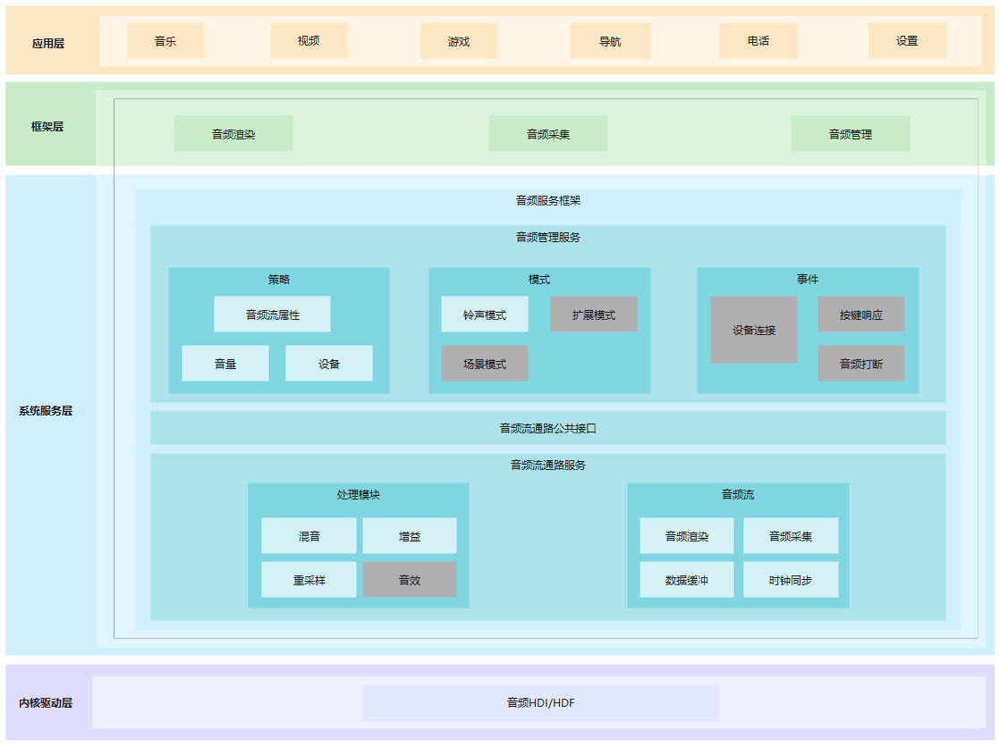

# 音频组件<a name="ZH-CN_TOPIC_0000001146901937"></a>

-   [简介](#section119mcpsimp)
    -   [基本概念](#section122mcpsimp)
-   [目录](#section179mcpsimp)
-   [使用说明](#section112738505318)
    -   [音频播放](#section1147510562812)
    -   [音频录制](#section295162052813)
    -   [音频管理](#section645572311287)
-   [支持的设备](#supported-devices)
-   [相关仓](#section340mcpsimp)

## 简介<a name="section119mcpsimp"></a>

音频组件用于实现音频相关的功能，包括音频播放，录制，音量管理和设备管理。

**图 1**  音频组件架构图<a name="fig483116248288"></a>  




### 基本概念<a name="section122mcpsimp"></a>

-   **采样**

采样是指将连续时域上的模拟信号按照一定的时间间隔采样，获取到离散时域上离散信号的过程。

-   **采样率**

采样率为每秒从连续信号中提取并组成离散信号的采样次数，单位用赫兹（Hz）来表示。通常人耳能听到频率范围大约在20Hz～20kHz之间的声音。常用的音频采样频率有：8kHz、11.025kHz、22.05kHz、16kHz、37.8kHz、44.1kHz、48kHz、96kHz、192kHz等。

-   **声道**

声道是指声音在录制或播放时在不同空间位置采集或回放的相互独立的音频信号，所以声道数也就是声音录制时的音源数量或回放时相应的扬声器数量。

-   **音频帧**

音频数据是流式的，本身没有明确的一帧帧的概念，在实际的应用中，为了音频算法处理/传输的方便，一般约定俗成取2.5ms\~60ms为单位的数据量为一帧音频。这个时间被称之为“采样时间”，其长度没有特别的标准，它是根据编解码器和具体应用的需求来决定的。

-   **PCM**

PCM（Pulse Code Modulation），即脉冲编码调制，是一种将模拟信号数字化的方法，是将时间连续、取值连续的模拟信号转换成时间离散、抽样值离散的数字信号的过程。

## 目录<a name="section179mcpsimp"></a>

仓目录结构如下：

```
/foundation/multimedia/audio_standard  # 音频组件业务代码
├── frameworks                         # 框架代码
│   ├── native                         # 内部接口实现
|   |                                    Pulseaudio, libsndfile构建配置和Pulseaudio -hdi模块
│   └── js                             # 外部接口实现
│       └── napi                       # napi 外部接口实现
├── interfaces                         # 接口代码
│   ├── inner_api                      # 内部接口
│   └── kits                           # 外部接口
├── sa_profile                         # 服务配置文件
├── services                           # 服务代码
├── LICENSE                            # 证书文件
└── ohos.build                         # 编译文件
```

## 使用说明<a name="section112738505318"></a>

### 音频播放<a name="section1147510562812"></a>

可以使用此仓库内提供的接口将音频数据转换为音频模拟信号，使用输出设备播放音频信号，以及管理音频播放任务。以下步骤描述了如何使用 **AudioRenderer** 开发音频播放功能：

1. 使用 **Create** 接口和所需流类型来获取 **AudioRenderer** 实例。

   ```
   AudioRendererOptions rendererOptions;
   rendererOptions.streamInfo.samplingRate = AudioSamplingRate::SAMPLE_RATE_44100;
   rendererOptions.streamInfo.encoding = AudioEncodingType::ENCODING_PCM;
   rendererOptions.streamInfo.format = AudioSampleFormat::SAMPLE_S16LE;
   rendererOptions.streamInfo.channels = AudioChannel::STEREO;
   rendererOptions.rendererInfo.contentType = ContentType::CONTENT_TYPE_MUSIC;
   rendererOptions.rendererInfo.streamUsage = StreamUsage::STREAM_USAGE_MEDIA;
   rendererOptions.rendererInfo.rendererFlags = 0;
   
   unique_ptr<AudioRenderer> audioRenderer = AudioRenderer::Create(rendererOptions);
   ```

2. （可选）静态接口 **GetSupportedFormats**(), **GetSupportedChannels**(), **GetSupportedEncodingTypes**(), **GetSupportedSamplingRates**() 可用于获取支持的参数。

3. （可选）使用 audioRenderer->GetRendererInfo(AudioRendererInfo &) 和 audioRenderer->GetStreamInfo(AudioStreamInfo &) 来获取当前的音频播放器配置信息。

4. 监听音频中断及状态改变事件，需要使用audioRenderer->SetRenderCallback注册到RenderCallbacks。

   ```
   class AudioRendererCallbackImpl : public AudioRendererCallback {
       void OnInterrupt(const InterruptEvent &interruptEvent) override
       {
           if (interruptEvent.forceType == INTERRUPT_FORCE) { // Forced actions taken by the framework
               switch (interruptEvent.hintType) {
                   case INTERRUPT_HINT_PAUSE:
                       // Force paused. Pause Writing.
                       isRenderPaused_ = true;
                   case INTERRUPT_HINT_STOP:
                       // Force stopped. Stop Writing.
                       isRenderStopped_ = true;
               }
           }
           if (interruptEvent.forceType == INTERRUPT_SHARE) { // Actions not forced, apps can choose to handle.
               switch (interruptEvent.hintType) {
                   case INTERRUPT_HINT_PAUSE:
                       // Do Pause, if required.
                   case INTERRUPT_HINT_RESUME:
                       // After force pause, resume if needed when this hint is received.
                       audioRenderer->Start();
               }
           }
       }
       void OnStateChange(const RendererState state) override
          {
              switch (state) {
                  case RENDERER_PREPARED:
                      // Renderer prepared
                  case RENDERER_RUNNING:
                      // Renderer in running state
                  case RENDERER_STOPPED:
                      // Renderer stopped
                  case RENDERER_RELEASED:
                      // Renderer released
                  case RENDERER_PAUSED:
                      // Renderer paused
              }
          }
      }
   
   std::shared_ptr<AudioRendererCallback> audioRendererCB = std::make_shared<AudioRendererCallbackImpl>();
   audioRenderer->SetRendererCallback(audioRendererCB);
   ```

   实现 AudioRendererCallback 类，重写 OnInterrupt 方法并使用 SetRendererCallback 接口注册此实例，通过SetRendererCallback实例注册，应用程序将接收中断事件。

   这包含了有关音频框架采取的音频中断强制操作的信息，以及是否要由应用来处理的操作。 有关详细信息，请参阅 audio_renderer.h 和 audio_info.h。        

   同样，可以通过重写 **AudioRendererCallback** 类中的 **OnStateChange** 函数来接收播放器状态更改回调。 有关播放器状态列表，请参阅 **audio_renderer.h**。

5. 为了获取帧标记位置/或帧周期位置的回调，可通过audioRenderer->**SetRendererPositionCallback** 或 audioRenderer->**SetRendererPeriodPositionCallback** 函数在音频播放器中注册相应的回调。

   ```
   class RendererPositionCallbackImpl : public RendererPositionCallback {
       void OnMarkReached(const int64_t &framePosition) override
       {
           // frame mark reached
           // framePosition is the frame mark number 
       }
   }
   
   std::shared_ptr<RendererPositionCallback> framePositionCB = std::make_shared<RendererPositionCallbackImpl>();
   //markPosition is the frame mark number for which callback is requested.
   audioRenderer->SetRendererPositionCallback(markPosition, framePositionCB); 
   
   class RendererPeriodPositionCallbackImpl : public RendererPeriodPositionCallback {
       void OnPeriodReached(const int64_t &frameNumber) override
       {
           // frame period reached
           // frameNumber is the frame period number 
       }
   }
   
   std::shared_ptr<RendererPeriodPositionCallback> periodPositionCB = std::make_shared<RendererPeriodPositionCallbackImpl>();
   //framePeriodNumber is the frame period number for which callback is requested.
   audioRenderer->SetRendererPeriodPositionCallback(framePeriodNumber, periodPositionCB); 
   ```

6. AudioRenderer 实例调用 audioRenderer->**Start**() 函数来启动播放任务。

7. 使用 **GetBufferSize** 接口获取要写入的缓冲区长度。

   ```
   audioRenderer->GetBufferSize(bufferLen);
   ```

8. 从源（例如音频文件）读取要播放的音频数据并将其传输到字节流中。重复调用Write函数写入渲染数据。

   ```
   bytesToWrite = fread(buffer, 1, bufferLen, wavFile);
   while ((bytesWritten < bytesToWrite) && ((bytesToWrite - bytesWritten) > minBytes)) {
       int32_t retBytes = audioRenderer->Write(buffer + bytesWritten, bytesToWrite - bytesWritten);
       if (bytesWritten < 0)
           break;
       bytesWritten += retBytes;
   }
   ```

9. 在音频中断的情况下，应用程序可能会遇到写入失败。不感知、不处理中断的应用程序在写入音频数据之前使用GetStatus API检查播放器状态。中断感知应用将通过AudioRenderCallback获得更多信息。

   ```
   while ((bytesWritten < bytesToWrite) && ((bytesToWrite - bytesWritten) > minBytes)) {
       int32_t retBytes = audioRenderer->Write(buffer.get() + bytesWritten, bytesToWrite - bytesWritten);
       if (retBytes < 0) { // Error occured
           if (audioRenderer_->GetStatus() == RENDERER_PAUSED) { // Query the state and take appropriate action
               isRenderPaused_ = true;
               int32_t seekPos = bytesWritten - bytesToWrite;
               fseek(wavFile, seekPos, SEEK_CUR))
           }
           break;
       }
       bytesWritten += retBytes;
   }
   ```

10. 调用audioRenderer->**Drain**()来清空播放流。

11. 调用audioRenderer->**Stop**()来停止输出。

12. 播放任务完成后，调用AudioRenderer实例的audioRenderer->**Release**()函数来释放资源。

13. 使用 audioRenderer->**SetVolume(float)** 和 audioRenderer->**GetVolume()** 来设置和获取当前音频流音量, 可选范围为 0.0 到 1.0。

提供上述基本音频播放使用范例。

更多接口说明请参考[**audio_renderer.h**](https://gitee.com/openharmony/multimedia_audio_standard/blob/master/interfaces/inner_api/native/audiorenderer/include/audio_renderer.h) 和 [**audio_info.h**](https://gitee.com/openharmony/multimedia_audio_standard/blob/master/interfaces/inner_api/native/audiocommon/include/audio_info.h)。

### 音频录制<a name="section295162052813"></a>

可以使用此仓库内提供的接口，让应用程序可以完成使用输入设备进行声音录制，将语音转换为音频数据，并管理录制的任务。以下步骤描述了如何使用 **AudioCapturer** 开发音频录制功能：

1. 使用Create接口和所需流类型来获取 **AudioCapturer** 实例。

   ```
   AudioCapturerOptions capturerOptions;
   capturerOptions.streamInfo.samplingRate = AudioSamplingRate::SAMPLE_RATE_48000;
   capturerOptions.streamInfo.encoding = AudioEncodingType::ENCODING_PCM;
   capturerOptions.streamInfo.format = AudioSampleFormat::SAMPLE_S16LE;
   capturerOptions.streamInfo.channels = AudioChannel::MONO;
   capturerOptions.capturerInfo.sourceType = SourceType::SOURCE_TYPE_MIC;
   capturerOptions.capturerInfo.capturerFlags = CAPTURER_FLAG;;
   
   unique_ptr<AudioCapturer> audioCapturer = AudioCapturer::Create(capturerOptions);
   ```

2. （可选）静态接口 **GetSupportedFormats**(), **GetSupportedChannels**(), **GetSupportedEncodingTypes**(), **GetSupportedSamplingRates**() 可用于获取支持的参数。

3.  （可选）使用audioCapturer->GetCapturerInfo（AudioCapturerInfo&）和audioCapturer->GetStreamInfo（AudioStreamInfo&）来获取当前的录制器的配置信息。

4. 通过重写 **AudioCapturerCallback** 类中的 **OnStateChange** 函数，并使用 audioCapturer->**SetCapturerCallback** 方法 注册回调实例来接收录制器状态更改回调。

   ```
   class AudioCapturerCallbackImpl : public AudioCapturerCallback {
       void OnStateChange(const CapturerState state) override
       {
           switch (state) {
               case CAPTURER_PREPARED:
                   // Capturer prepared
               case CAPTURER_RUNNING:
                   // Capturer in running state
               case CAPTURER_STOPPED:
                   // Capturer stopped
               case CAPTURER_RELEASED:
                   // Capturer released
           }
       }
   }
   
   std::shared_ptr<AudioCapturerCallback> audioCapturerCB = std::make_shared<AudioCapturerCallbackImpl>();
   audioCapturer->SetCapturerCallback(audioCapturerCB);
   ```

5. 为了获得帧标记位置/或帧周期位置的回调，可通过 audioCapturer->**SetCapturerPositionCallback** 或 audioCapturer->**SetCapturerPeriodPositionCallback** 函数在音频录制器中注册相应的回调。

   ```
   class CapturerPositionCallbackImpl : public CapturerPositionCallback {
       void OnMarkReached(const int64_t &framePosition) override
       {
           // frame mark reached
           // framePosition is the frame mark number 
       }
   }
   
   std::shared_ptr<CapturerPositionCallback> framePositionCB = std::make_shared<CapturerPositionCallbackImpl>();
   //markPosition is the frame mark number for which callback is requested.
   audioCapturer->SetCapturerPositionCallback(markPosition, framePositionCB); 
   
   class CapturerPeriodPositionCallbackImpl : public CapturerPeriodPositionCallback {
       void OnPeriodReached(const int64_t &frameNumber) override
       {
           // frame period reached
           // frameNumber is the frame period number 
       }
   }
   
   std::shared_ptr<CapturerPeriodPositionCallback> periodPositionCB = std::make_shared<CapturerPeriodPositionCallbackImpl>();
   //framePeriodNumber is the frame period number for which callback is requested.
   audioCapturer->SetCapturerPeriodPositionCallback(framePeriodNumber, periodPositionCB); 
   ```

   如需取消回调，请调用相应的 audioCapturer->**UnsetCapturerPositionCallback** 或 audioCapturer->**UnsetCapturerPeriodPositionCallback** 方法。

6. AudioCapturer 实例调用 AudioCapturer->**Start**() 函数来启动录音任务。

7. 使用 **GetBufferSize** 接口获取要写入的缓冲区长度。

   ```
   audioCapturer->GetBufferSize(bufferLen);
   ```

8. 读取录制的音频数据并将其转换为字节流。重复调用read函数读取数据直到主动停止。

   ```
   // set isBlocking = true/false for blocking/non-blocking read
   bytesRead = audioCapturer->Read(*buffer, bufferLen, isBlocking);
   while (numBuffersToCapture) {
       bytesRead = audioCapturer->Read(*buffer, bufferLen, isBlockingRead);
       if (bytesRead < 0) {
           break;
       } else if (bytesRead > 0) {
           fwrite(buffer, size, bytesRead, recFile); // example shows writes the recored data into a file
           numBuffersToCapture--;
       }
   }
   ```

9. （可选）audioCapturer->**Flush**() 来清空流缓冲区数据。

10. AudioCapturer 实例调用 audioCapturer->**Stop**() 函数停止录音。

11. 录音任务完成后，调用 AudioCapturer 实例的 audioCapturer->**Release**() 函数释放资源。

提供上述基本音频录制使用范例。更多API请参考[**audio_capturer.h**](https://gitee.com/openharmony/multimedia_audio_standard/blob/master/interfaces/inner_api/native/audiocapturer/include/audio_capturer.h)和[**audio_info.h**](https://gitee.com/openharmony/multimedia_audio_standard/blob/master/interfaces/inner_api/native/audiocommon/include/audio_info.h)。

### 音频管理<a name="section645572311287"></a>
可以使用 [**audio_system_manager.h**](https://gitee.com/openharmony/multimedia_audio_standard/blob/master/interfaces/inner_api/native/audiomanager/include/audio_system_manager.h) 内的接口来控制音量和设备。
1. 使用 **GetInstance** 接口获取 **AudioSystemManager** 实例.
    ```
    AudioSystemManager *audioSystemMgr = AudioSystemManager::GetInstance();
    ```

**音量控制**

2. 使用 **GetMaxVolume** 和  **GetMinVolume** 接口去查询音频流支持的最大和最小音量等级，在此范围内设置音量。
    ```
    AudioSystemManager::AudioVolumeType streamType = AudioSystemManager::AudioVolumeType::STREAM_MUSIC;
    int32_t maxVol = audioSystemMgr->GetMaxVolume(streamType);
    int32_t minVol = audioSystemMgr->GetMinVolume(streamType);
    ```
3. 使用 **SetVolume** 和 **GetVolume** 接口来设置和获取指定音频流的音量等级。
    ```
    int32_t result = audioSystemMgr->SetVolume(streamType, 10);
    int32_t vol = audioSystemMgr->GetVolume(streamType);
    ```
4. 使用 **SetMute** 和 **IsStreamMute** 接口来设置和获取指定音频流的静音状态。
    ```
    int32_t result = audioSystemMgr->SetMute(streamType, true);
    bool isMute = audioSystemMgr->IsStreamMute(streamType);
    ```
5. 使用 **SetRingerMode** 和 **GetRingerMode** 接口来设置和获取铃声模式。参考在 [**audio_info.h**](https://gitee.com/openharmony/multimedia_audio_standard/blob/master/interfaces/inner_api/native/audiocommon/include/audio_info.h)  定义的 **AudioRingerMode** 枚举来获取支持的铃声模式。
    ```
    int32_t result = audioSystemMgr->SetRingerMode(RINGER_MODE_SILENT);
    AudioRingerMode ringMode = audioSystemMgr->GetRingerMode();
    ```
6. 使用 **SetMicrophoneMute** 和 **IsMicrophoneMute** 接口来设置和获取麦克风的静音状态。
    ```
    int32_t result = audioSystemMgr->SetMicrophoneMute(true);
    bool isMicMute = audioSystemMgr->IsMicrophoneMute();
    ```

**设备控制**

7. 使用 **GetDevices**, **deviceType_** 和 **deviceRole_** 接口来获取音频输入输出设备信息。 参考 [**audio_info.h**](https://gitee.com/openharmony/multimedia_audio_standard/blob/master/interfaces/inner_api/native/audiocommon/include/audio_info.h) 内定义的DeviceFlag, DeviceType 和 DeviceRole 枚举。
    ```
    DeviceFlag deviceFlag = ALL_DEVICES_FLAG;
    vector<sptr<AudioDeviceDescriptor>> audioDeviceDescriptors = audioSystemMgr->GetDevices(deviceFlag);
    for (auto &audioDeviceDescriptor : audioDeviceDescriptors) {
        cout << audioDeviceDescriptor->deviceType_ << endl;
        cout << audioDeviceDescriptor->deviceRole_ << endl;
    }
    ```
    
8. 使用 **SetDeviceActive** 和 **IsDeviceActive** 接口去激活/去激活音频设备和获取音频设备激活状态。
     ```
    ActiveDeviceType deviceType = SPEAKER;
    int32_t result = audioSystemMgr->SetDeviceActive(deviceType, true);
    bool isDevActive = audioSystemMgr->IsDeviceActive(deviceType);
    ```
    
9. 使用 **SetDeviceChangeCallback** 方法注册设备更改事件。 当设备连接/断开连接时，客户端将收到回调。当前音频子系统支持为 WIRED_HEADSET、USB_HEADSET 和 BLUETOOTH_A2DP 设备发送设备更改事件。         

     **OnDeviceChange** 函数被调用时，客户端将收到 **DeviceChangeAction** 对象，该对象将包含以下参数：           

     *type* : **DeviceChangeType** 指定设备是连接还是断开。   
     *deviceDescriptors* : **AudioDeviceDescriptor** 对象的数组，它指定设备的类型及其角色（输入/输出设备）。     

     ```
      class DeviceChangeCallback : public AudioManagerDeviceChangeCallback {
      public:
          DeviceChangeCallback = default;
          ~DeviceChangeCallback = default;
          void OnDeviceChange(const DeviceChangeAction &deviceChangeAction) override
          {
              cout << deviceChangeAction.type << endl;
              for (auto &audioDeviceDescriptor : deviceChangeAction.deviceDescriptors) {
                  switch (audioDeviceDescriptor->deviceType_) {
                      case DEVICE_TYPE_WIRED_HEADSET: {
                          if (deviceChangeAction.type == CONNECT) {
                              cout << wired headset connected << endl;
                          } else {
                              cout << wired headset disconnected << endl;
                          }
                          break;
                      }
                      case DEVICE_TYPE_USB_HEADSET:{
                          if (deviceChangeAction.type == CONNECT) {
                              cout << usb headset connected << endl;
                          } else {
                              cout << usb headset disconnected << endl;
                          }
                          break;
                      }
                      case DEVICE_TYPE_BLUETOOTH_A2DP:{
                          if (deviceChangeAction.type == CONNECT) {
                              cout << Bluetooth device connected << endl;
                          } else {
                              cout << Bluetooth device disconnected << endl;
                          }
                          break;
                      }
                      default: {
                          cout << "Unsupported device" << endl;
                          break;
                      }
                  }
              }
          }
      };
     
      auto callback = std::make_shared<DeviceChangeCallback>();
      audioSystemMgr->SetDeviceChangeCallback(callback);
     ```

10. 提供其他用途的接口如 **IsStreamActive**, **SetAudioParameter**, **GetAudioParameter**, 详细请参考 [**audio_system_manager.h**](https://gitee.com/openharmony/multimedia_audio_standard/blob/master/interfaces/inner_api/native/audiomanager/include/audio_system_manager.h)

11. 应用可使用AudioManagerAPI:：On注册系统音量的变化。当应用程序注册到volume change event（音量更改事件）时，每当音量发生更改时，应用程序都会收到以下参数的通知：volumeType：更新的 AudioVolumeType。 volume：当前音量级别设置。 updateUi : 是否需要显示音量变化细节。 （如果通过音量键上/下更新音量，我们将 updateUi 标志设置为 true，在其他情况下 updateUi 设置为 false）。

    ```
       const audioManager = audio.getAudioManager();
       
       export default {
            onCreate() {
                audioManager.on('volumeChange', (volumeChange) ==> {
                    console.info('volumeType = '+volumeChange.volumeType);
                    console.info('volume = '+volumeChange.volume);
                    console.info('updateUi = '+volumeChange.updateUi);
                }
            }
       }
    ```

**音频场景**

12. 使用 **SetAudioScene** 和 **getAudioScene** API 分别更改和检查音频策略.

    ```
    int32_t result = audioSystemMgr->SetAudioScene(AUDIO_SCENE_PHONE_CALL);
    AudioScene audioScene = audioSystemMgr->GetAudioScene();
    ```

    请参考 [**audio_info.h**](https://gitee.com/openharmony/multimedia_audio_standard/blob/master/interfaces/inner_api/native/audiocommon/include/audio_info.h) 中的 **AudioScene**支持的音频场景。

**JavaScript 用法:**

JavaScript应用可以使用系统提供的音频管理接口，来控制音量和设备。
请参考 [**音频管理.md**](https://gitee.com/openharmony/docs/blob/master/zh-cn/application-dev/js-reference/音频管理.md) 来获取音量和设备管理相关JavaScript接口的用法。

### 铃声管理

可以使用 iringtone_sound_manager.h 和 iringtone_player.h 中提供的 接口来实现铃声播放功能。

1. 使用CreateRingtoneManager接口获取IRingtoneSoundManager实例。

   ```
   std::shared_ptr<IRingtoneSoundManager> ringtoneManagerClient = RingtoneFactory::CreateRingtoneManager();
   ```

2. 使用 SetSystemRingtoneUri 接口设置系统铃声 uri。

   ```
   std::string uri = "/data/media/test.wav";
   RingtoneType ringtoneType = RINGTONE_TYPE_DEFAULT;
   ringtoneManagerClient->SetSystemRingtoneUri(context, uri, ringtoneType);
   ```

3. 使用GetRingtonePlayer 接口获取IRingtonePlayer实例。

   ```
   std::unique_ptr<IRingtonePlayer> ringtonePlayer = ringtoneManagerClient->GetRingtonePlayer(context, ringtoneType);
   ```

4. 使用 Configure 接口配置铃声播放器。

   ```
   float volume = 1;
   bool loop = true;
   ringtonePlayer.Configure(volume, loop);
   ```

5. 在铃声播放器实例上使用Start、Stop和Release 接口来控制播放状态。

   ```
   ringtonePlayer.Start();
   ringtonePlayer.Stop();
   ringtonePlayer.Release();
   ```

6. 使用 GetTitle 接口获取当前系统铃声的标题。

7. 使用 GetRingtoneState 来设置铃声播放状态： RingtoneState

8. 使用 GetAudioRendererInfo 获取 AudioRendererInfo 以获取媒体类型和流的使用类型。

## 支持的设备<a name="supported-devices"></a>

目前音频子系统支持的以下设备类型列表：

1. **USB耳机**
   数字耳机，耳机内包含DAC(数模转换)和功放。
2. **有线耳机**
   模拟耳机，不含DAC。支持3.5mm接口或不带DAC的Type-C接口。
3. **蓝牙耳机**
   蓝牙耳机，使用a2dp（蓝牙音频传输模型协议），用于无线传输音频。
4. **内部扬声器和麦克风**
   支持内置扬声器和麦克风，分别用作播放和录制的默认设备。

## 相关仓<a name="section340mcpsimp"></a>

[multimedia\_audio\_standard](https://gitee.com/openharmony/multimedia_audio_standard)

